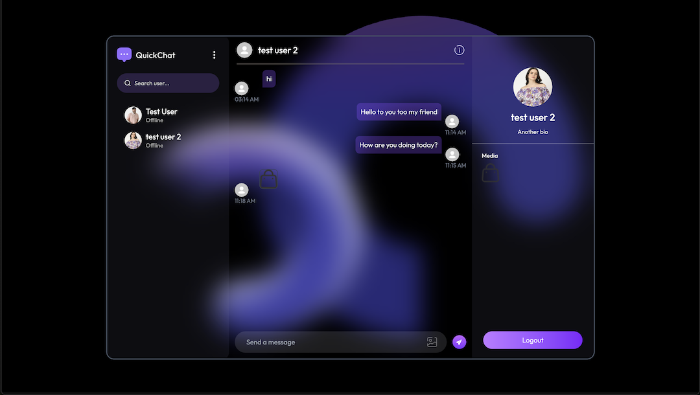
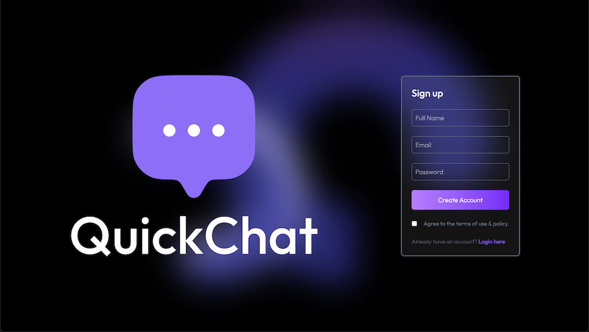
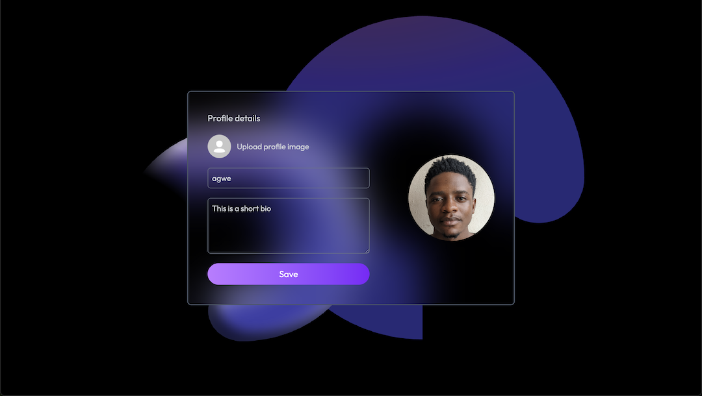

# QuickChat

QuickChat is a modern, full-stack real-time chat application designed for seamless, secure, and engaging communication. Built with a focus on performance, scalability, and user experience, QuickChat demonstrates best practices in both frontend and backend development using the latest technologies.

## 🚀 Features

- **Real-Time Messaging:** Instant chat powered by Socket.IO for a smooth, live experience.
- **User Authentication:** Secure signup and login with JWT and bcrypt password hashing.
- **Profile Management:** Users can update their profile, including uploading and compressing profile images.
- **Unread Message Count:** See how many messages you haven't read from each user.
- **Responsive UI:** Beautiful, mobile-friendly interface built with React and Tailwind CSS.
- **Image Uploads:** Profile images are compressed on the client and stored securely in Cloudinary.
- **Optimized Performance:** Backend responses are compressed (gzip/Brotli), and frontend uses code-splitting and lazy loading.
- **Security Best Practices:** Input sanitization, secure HTTP headers, and CORS protection.
- **Error Handling & Logging:** Robust error handling and logging for maintainability.

## 🛠️ Tech Stack & Libraries

### Frontend

- **React** (with Hooks & Context API)
- **Vite** (for fast development)
- **Socket.IO Client** (real-time communication)
- **Tailwind CSS** (utility-first styling)
- **browser-image-compression** (client-side image compression)

### Backend

- **Node.js** & **Express**
- **MongoDB** (with Mongoose ODM)
- **Socket.IO** (real-time server)
- **Cloudinary** (image storage)
- **bcryptjs** (password hashing)
- **jsonwebtoken** (JWT authentication)
- **compression** (gzip/Brotli response compression)
- **dotenv** (environment variable management)
- **multer** (for file uploads, if using multipart/form-data)
- **CORS** (cross-origin resource sharing)
- **Custom Logger** (for error and event logging)

## 📸 Screenshots

- 
- 
- 

## 🏗️ Project Structure

- **/client**: React frontend
- **/backend**: Express/MongoDB backend
- **/project_screenshots**: App screenshots

## 📝 How to Run Locally

1. **Clone the repository:**
   ```sh
   git clone https://github.com/yourusername/quickchat.git
   cd quickchat
   ```
2. **Setup environment variables:**
   - Copy `.env.example` to `.env` in `/backend` and fill in your credentials.
3. **Install dependencies:**
   ```sh
   cd backend && npm install
   cd ../client && npm install
   ```
4. **Start the backend:**
   ```sh
   cd ../backend && npm start
   ```
5. **Start the frontend:**
   ```sh
   cd ../client && npm run dev
   ```
6. **Visit** `http://localhost:5173` in your browser.

> **Let's build the future of communication together!**
